# Pipeline Architecture Diagram

```mermaid
flowchart LR
    A[Developer Commit] --> B[GitHub Repository]
    B --> C[Jenkins Pipeline]
    C --> D[Checkout]
    D --> E[Build]
    E --> F[Automated Tests]
    F --> G[Docker Build]
    G --> H[Docker Hub Registry]
    H --> I[Docker Swarm Service]
    I --> J[Rolling Update: 3 Replicas, 1 at a Time]
    J --> K[Health Verification]
    K --> L{Rollback Demo?}
    L -- No --> M[Healthy Release]
    L -- Yes --> N[Deploy Broken Image]
    N --> O[Update Paused]
    O --> P[Swarm Rollback]
    P --> Q[Verify Recovered Version]
    Q --> M
```



Plain text:

```text
GitHub
  |
Jenkins
  |
Checkout -> Build -> Test -> Docker Build -> Docker Hub
                                      |
                                      v
                                Docker Swarm
                                      |
                           Rolling Update (3 replicas)
                                      |
                                   Verify
                                      |
                           Controlled Bad Release
                                      |
                                Update Paused
                                      |
                                   Rollback
                                      |
                              Healthy App Restored
```
